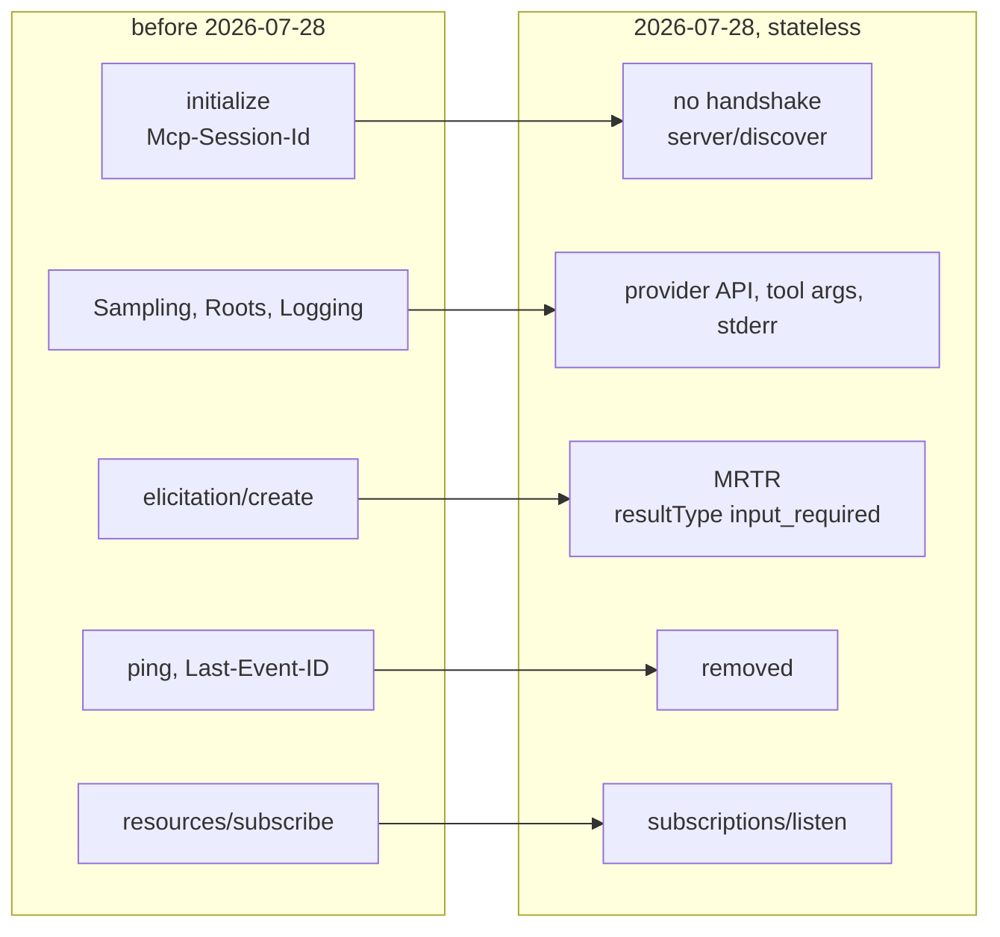
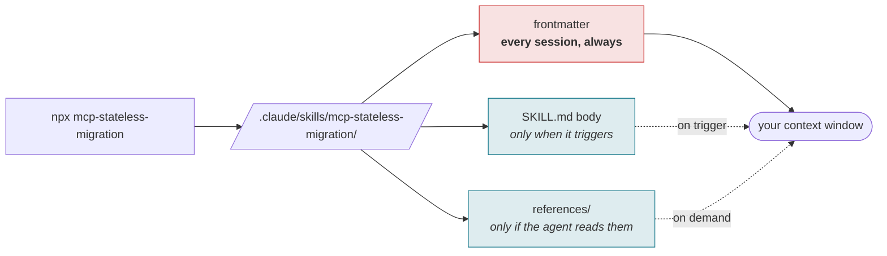

# mcp-stateless-migration

[](https://www.npmjs.com/package/mcp-stateless-migration)
[](LICENSE)
[-0b7285)](https://efaimo.ai/skills)
[](https://github.com/efaimo-ai/mcp-stateless-migration/actions/workflows/house-style.yml)

An Agent Skill for migrating an MCP server to the stateless MCP specification
published on **2026-07-28**.

<!-- generated:install -->

## Install

```sh
npx mcp-stateless-migration                 # into ./.claude/skills/mcp-stateless-migration/
npx mcp-stateless-migration --global        # into ~/.claude/skills/mcp-stateless-migration/
npx mcp-stateless-migration --check         # installed, and current?
```

The package is the skill: `SKILL.md` and its `references/`, nothing else. The
installer copies them, reads every byte back, and fails if what landed is not
what it wrote. It refuses to overwrite a directory whose contents differ unless
you pass `--force`, and installing the same version twice is a success rather
than a conflict.

Or take it by hand. It is markdown; `npx mcp-stateless-migration --print` writes `SKILL.md` to
stdout, and the repository is the whole thing.

<!-- /generated:install -->

## What moves



Thirteen changes in total. Two of them have no readiness rule behind them and
have to be checked by hand; the skill says which two where an agent will read it.

## Why a skill and not a blog post

The revision published on 2026-07-28, later than many model training cutoffs, so
a coding agent asked to "make this server 2026-07-28 ready" is working from the
old protocol or from guesses.

There is a second trap underneath that one. For the 68 days between the Release
Candidate locking on 2026-05-21 and the spec publishing, the RC was the only
thing there was to read, and it is not the published spec: server identity
moved into `_meta`, `DiscoverResult` became cacheable, and three error codes
were renumbered. You do not have to take that on trust, and you do not need a
survey of the internet to apply it. It is a one line test on any source you are
about to follow: if it names `DiscoverResult.serverInfo`, or error `-32003` or
`-32004`, it is reading the RC.

We know the trap is real because we fell into it. efaimo's own readiness rules
were written against the RC, and for four days after the spec published they
reported "identity unknown" for exactly the servers that had finished
migrating. The fix, and the diff that found it, are what this skill packages.

This skill carries the published shapes, the deltas from the RC, and the two
commands that prove the migration landed.

Everything in it is verified against `schema/2026-07-28/schema.ts` at tag
`2026-07-28` in `modelcontextprotocol/modelcontextprotocol`, not against a
summary. `references/rc-vs-final.md` includes the commands to reproduce the
RC-to-final diff yourself.

## Install

Copy the directory into your skills location, for example:

```bash
git clone --depth 1 https://github.com/efaimo-ai/mcp-stateless-migration \
  ~/.claude/skills/mcp-stateless-migration
```

## What is in it

| file | loaded | contents |
|---|---|---|
| `SKILL.md` | on trigger | the three-step procedure: measure, change, prove |
| `references/changes.md` | on demand | all thirteen changes with their SEP or PR, and the shapes to emit |
| `references/rc-vs-final.md` | on demand | what moved between the locked RC and the published spec |
| `references/verify.md` | on demand | how to prove it landed, and what a passing suite still misses |

## Its own numbers

Audited by [efaimo](https://github.com/efaimo-ai/efaimo), which is the same
tool this skill tells you to run:

```
$ npx efaimo check --skill ./mcp-stateless-migration
efaimo v0.1.2
check skill  mcp-stateless-migration
grade A (100)   0 errors  0 warnings  0 info

  no findings. clean.

rules: https://github.com/efaimo-ai/efaimo/blob/main/docs/RULES.md

$ npx efaimo weigh ./mcp-stateless-migration
efaimo v0.1.2
  skill                        metadata      body  lines  refs
  mcp-stateless-migration           104     1,428    109  3 files 3,690

totals: metadata 104 (always loaded) | body 1,428 (on trigger) | referenced 3,690 (on demand)

note: metadata loads at session start for every installed skill; body loads on trigger; referenced files load on demand
note: token counts are o200k_base estimates (see docs/METHODOLOGY.md)
```

Captured verbatim from `efaimo@0.1.2` on 2026-08-03. The one edit: the
`weigh skills` header line is removed, because it prints this machine's
absolute path. (Until 2026-08-02 this section quoted a reference count of
3,305 from the commit before `references/changes.md` gained its thirteenth
change: the numbers had outlived the measurement by one commit, in the README
of a brand whose product exists to catch exactly that.)

104 tokens sit in your context at all times, which is what every installed
skill costs you whether or not you use it. The 1,428 token body loads only when
the skill triggers, and the 3,690 tokens of reference material only when it is
actually read. Those are a measurement of the commit you are reading, not a
promise about the next one: re-run both commands yourself, which is the point
of quoting them at all.

## Scope

This skill tells you what to change and how to prove it landed. It does not
migrate the code for you, and a clean `efaimo` readiness list is not the same as
all thirteen changes done: two of them (the `Mcp-Method` / `Mcp-Name` headers, and
Tasks moving to an extension) have no readiness rule behind them and need
checking by hand. `SKILL.md` says so where an agent will read it.

<!-- generated:pipeline -->

## What installing it does to a session

A skill is not free just because it is markdown. Its frontmatter is loaded at
the start of every session for every skill you have installed, whether or not it
ever fires.



In this skill's case, measured by [efaimo](https://github.com/efaimo-ai/efaimo) `weigh` (v0.5.0, 2026-09-04):
**104 tokens always resident**, 1,428 when it triggers, 3,690 across 3 reference files if the agent reads to the end.

<!-- /generated:pipeline -->

## The set

Seven skills, each one a discipline that cost something to learn.

| skill | the question it asks |
|---|---|
| [`red-before-green`](https://github.com/efaimo-ai/red-before-green) | can this check fail at all? |
| [`denominator`](https://github.com/efaimo-ai/denominator) | how much of the world can it see? |
| [`read-back`](https://github.com/efaimo-ai/read-back) | did the write actually apply? |
| [`claim-sweep`](https://github.com/efaimo-ai/claim-sweep) | what else still asserts the old value? |
| [`unreleased-guard`](https://github.com/efaimo-ai/unreleased-guard) | does the copy describe what shipped? |
| [`honest-chart`](https://github.com/efaimo-ai/honest-chart) | is the picture proportional to the data? |
| **`mcp-stateless-migration`** (this one) | does this server match the 2026-07-28 spec? |

All of them are audited by [`efaimo`](https://github.com/efaimo-ai/efaimo), the
CLI that measures the quality and context-window cost of MCP servers and Agent
Skills. The index of every public skill it can find, graded, is at
[efaimo.ai/skills](https://efaimo.ai/skills).

## License

Apache-2.0. See [`LICENSE`](LICENSE) and [`NOTICE`](NOTICE).
